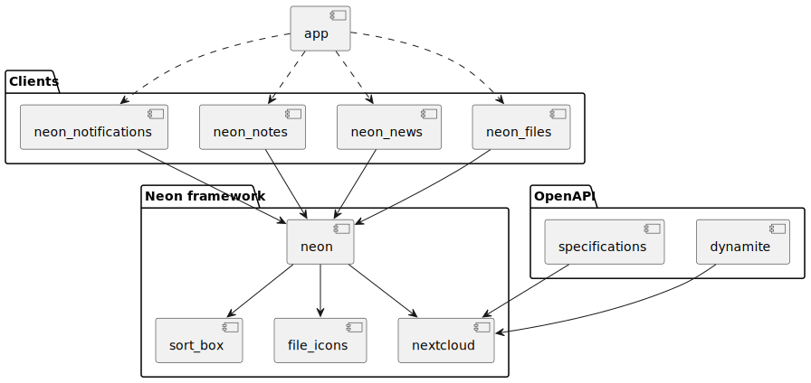

# Architecture overview

The framework consists of multiple packages:
- For APIs the nextcloud package provides the implementations. The dynamite generator generates the code using the OpenAPI specs.
- The main package is the neon package that provides widgets and functionality that is useful for building a Nextcloud client. It also manages the global state at runtime so that the app implementations do not have to manage things like multiple accounts for example.
- The individual apps are implemented as separate packages. Those depend on the neon framework and implement a few interfaces so that the neon framework can use them.
- On top of all that sits the app package that injects the relevant app implementations into the framework. It is possible to configure which app implementations should be included and how the app is branded.
