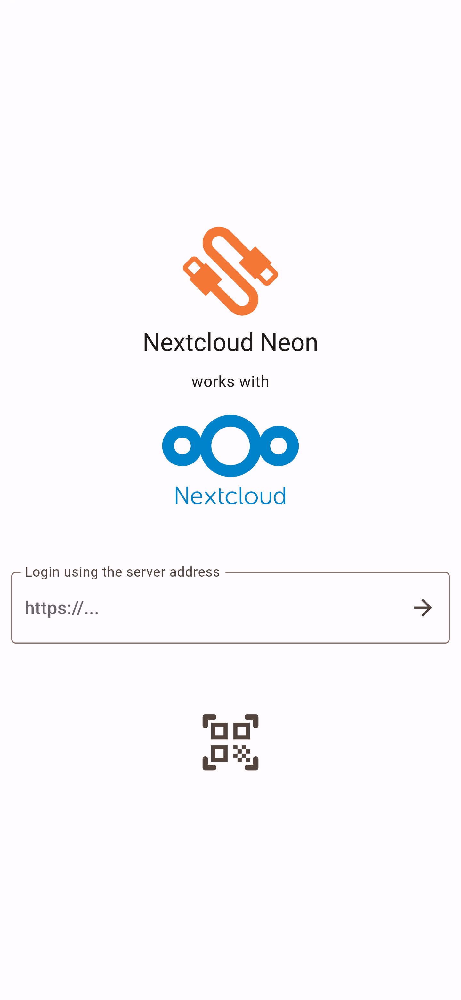
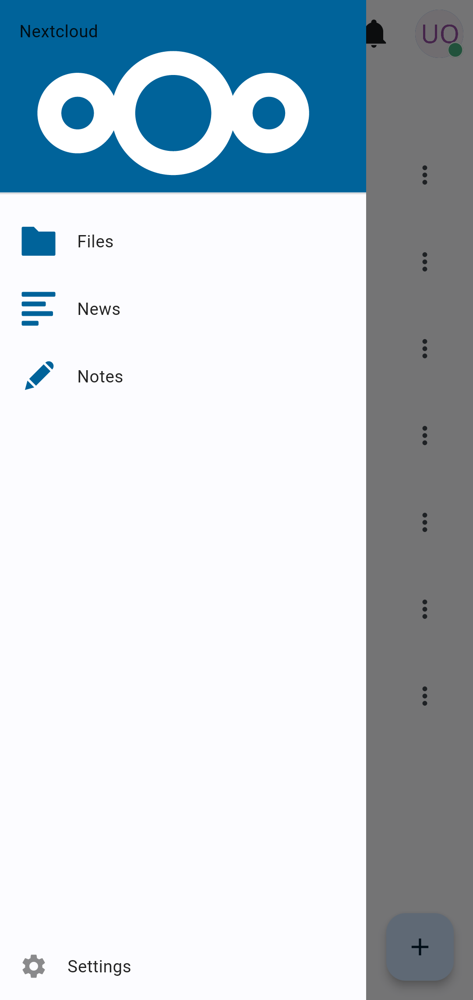
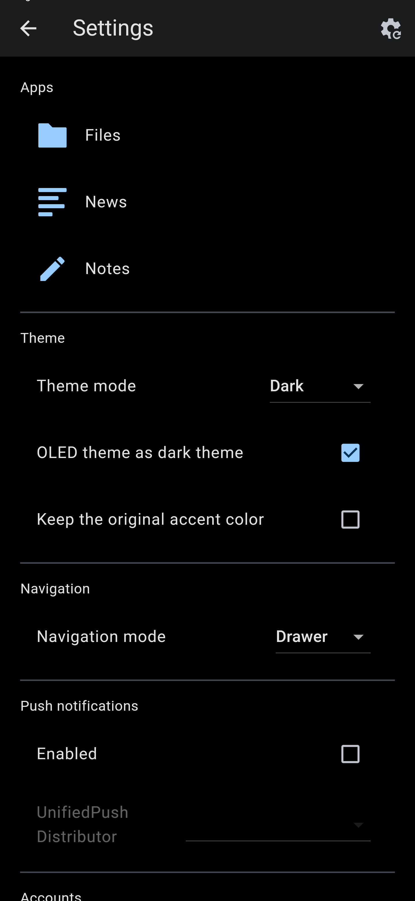
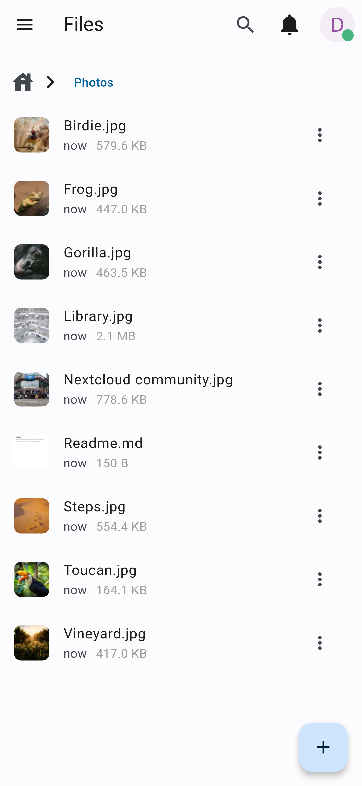
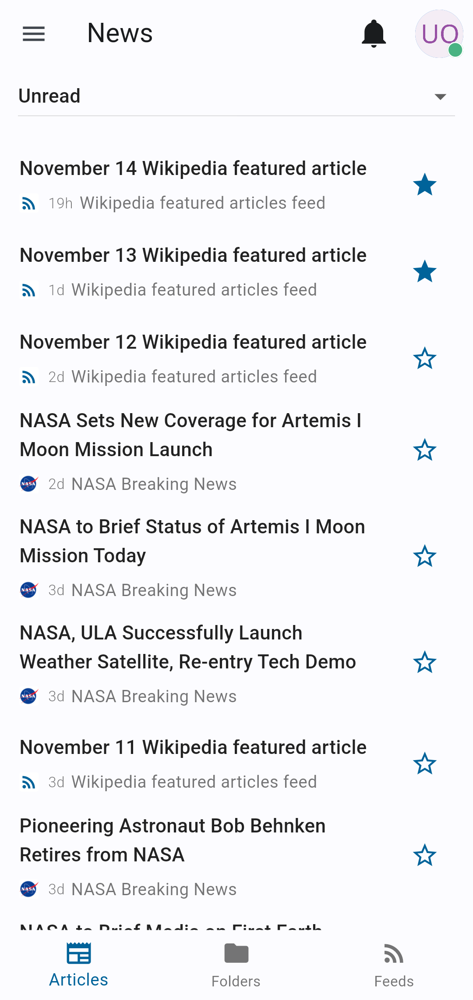
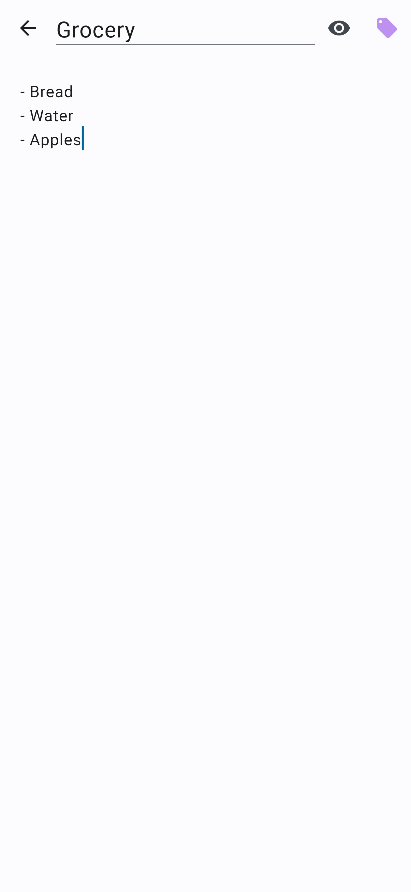
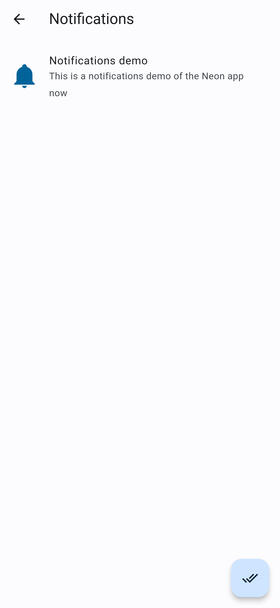

# neon

A beautiful convergent cross-platform client for Nextcloud written in Flutter.

## Install
You can build it yourself from source or download it from the automatic build pipelines.  
The app will be published on F-Droid, the Google Playstore and Flathub later on.

## Screenshots

For more screenshots see `./screenshots/`.

|  |                |    |
|---------------------------------------------|------------------------------------------------|--------------------------------------|
|            |  |  |
|      |                                                |                                      |
