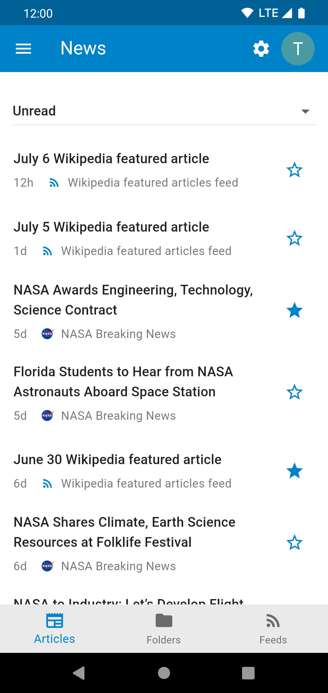

# harbour

A beautiful convergent cross-platform client for Nextcloud written in Flutter.

## Screenshots

For more screenshots see `./screenshots/`.

|     |  |  |
|------------------------------------------------|------------------------------------|------------------------------------|
|  |   |     |
