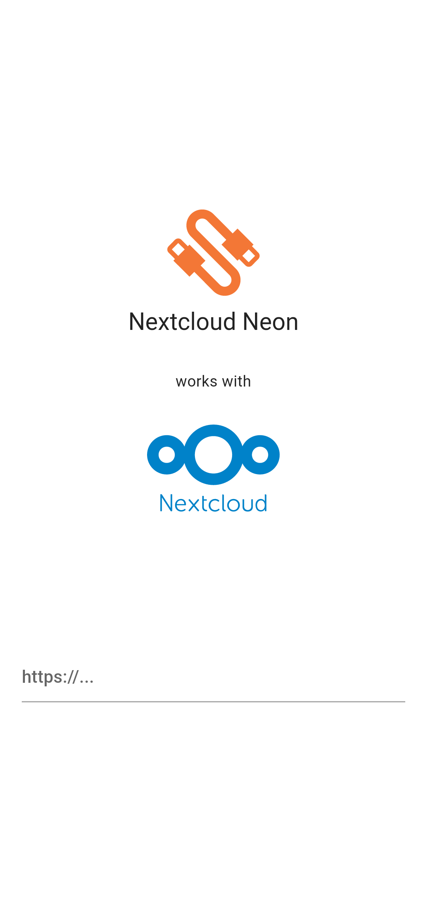
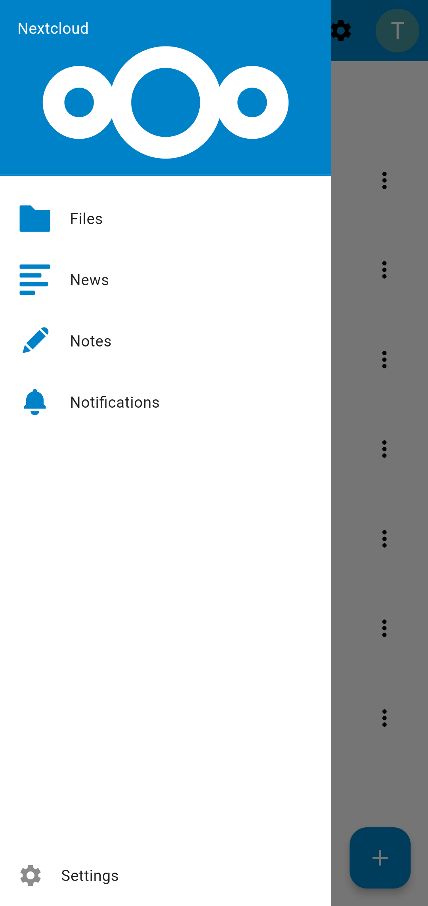
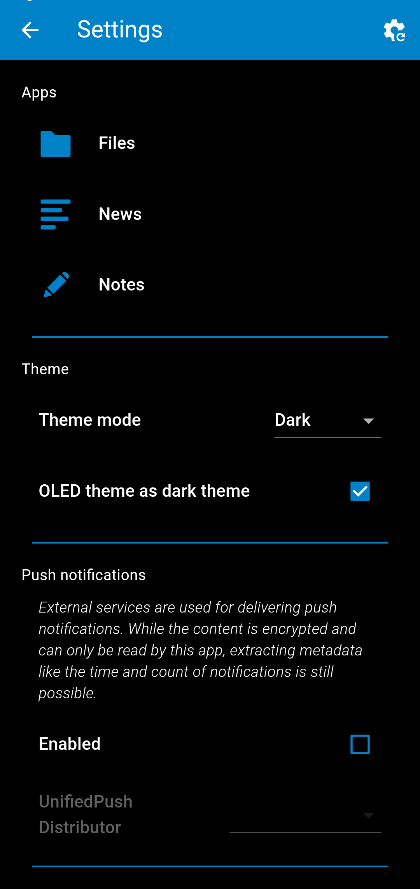
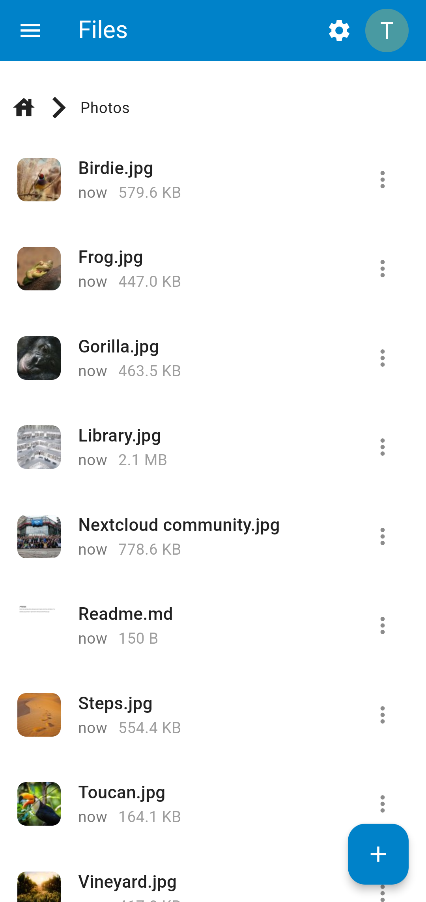
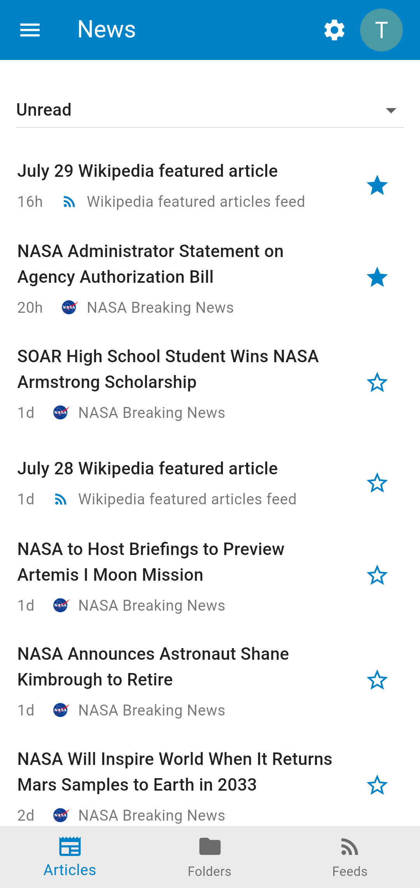
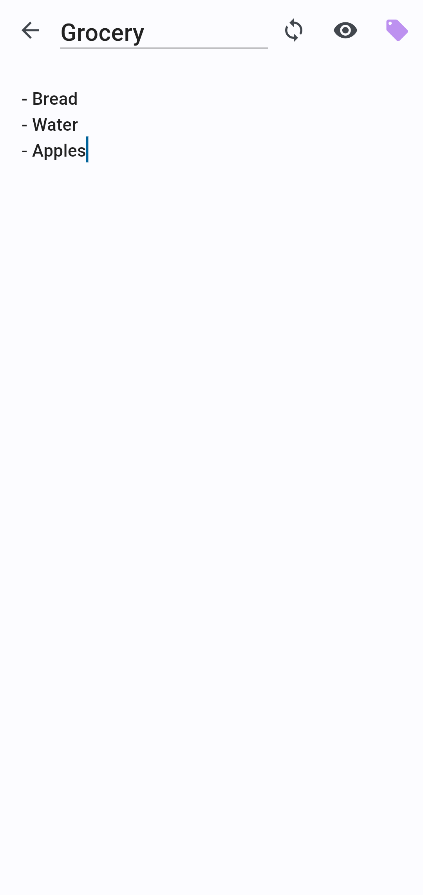
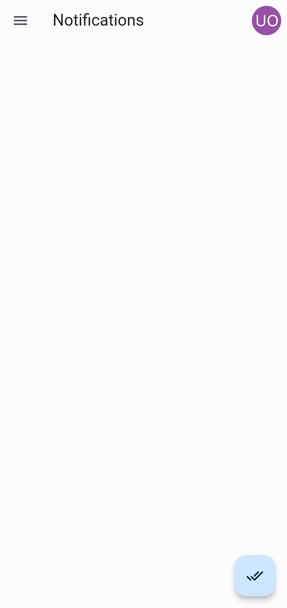

# neon

A beautiful convergent cross-platform client for Nextcloud written in Flutter.

## Install
You can easily build it yourself or use the F-Droid Nightly repository at https://github.com/jld3103/nextcloud-neon-nightly which builds directly from the main branch.  
The app will be published on F-Droid and the Google Playstore later.

## Screenshots

For more screenshots see `./screenshots/`.

|  |                |    |
|---------------------------------------------|------------------------------------------------|--------------------------------------|
|            |  |  |
|      |                                                |                                      |
